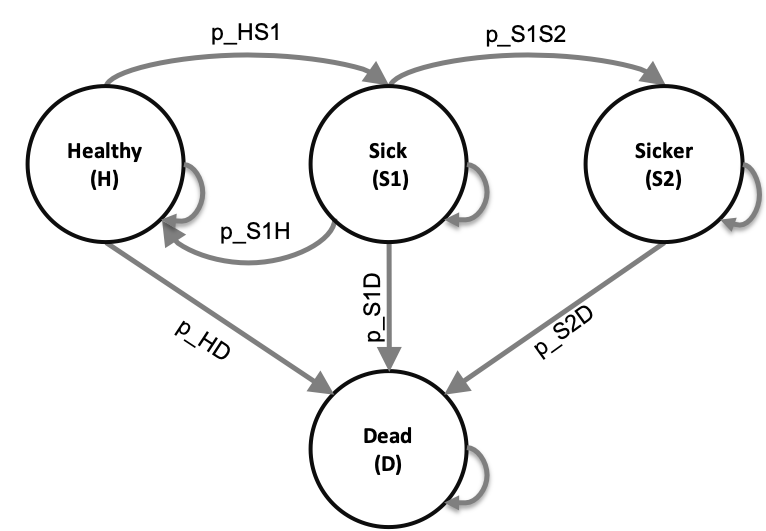

## Learning objectives

By the end of Day 2, participants should be able to:

- Understand implementation differences between microsimulation and cohort state transition models
- Understand how to summarize the output from a microsimulation model
- Understand how to incorporate more complex dependencies and dynamics in a microsimulation model
- Implement a microsimulation in R
- Understand how to convert a decision analytic model from an R script to an R function

## Day 2 schedule

| Time | Material |
|---|---|
| 10:00am-10:15am | Review of Day 1 material
| 10:15am-10:45am | Making your model a function: How and why
| 10:45am-12:00pm | Code walk through: Microsimulation 3-state model
| 12:00pm-12:30pm | Lunch
| 12:30pm-2:00pm  | Hands-on exercise: Code your own microsimulation model with Sick-Sicker example
| 2:00pm-4:00pm   | Advanced topics - TBD

## Materials

<a href="../slides/day2/Microsimulation_Slides.pdf" download>Download slides: Microsimulation modeling in R</a>   

<a href="../code/day2/Functions_cSTM_3state_time_demo.R" download>Download R code demo & walkthrough - Make your model a function</a>   

<a href="../code/day2/microsim_3-state_time.Rmd" download>Download R code demo & walkthrough - 3-state microsimulation</a>   

### Exercise - Sick-Sicker microsimulation with time dependency   

{width=60%}     

<a href="../data/mortProb_age.csv" download>
  Download data: ‘mortProb_age.csv’
</a> 

<a href="../data/MyPopulation-AgeDistribution.csv" download>
  Download data: ‘MyPopulation-AgeDistribution.csv’
</a> 

<a href="../exercises/microsim_Sick-Sicker_time_exercise_template.Rmd" download>
  Download exercise template
</a>
