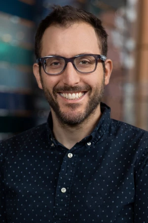
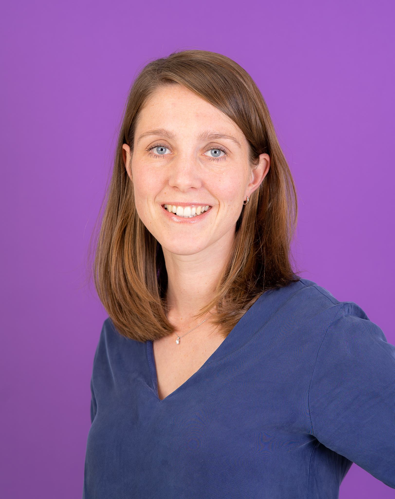
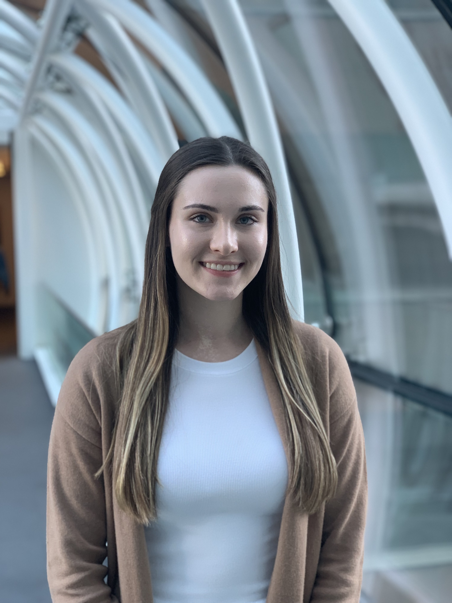
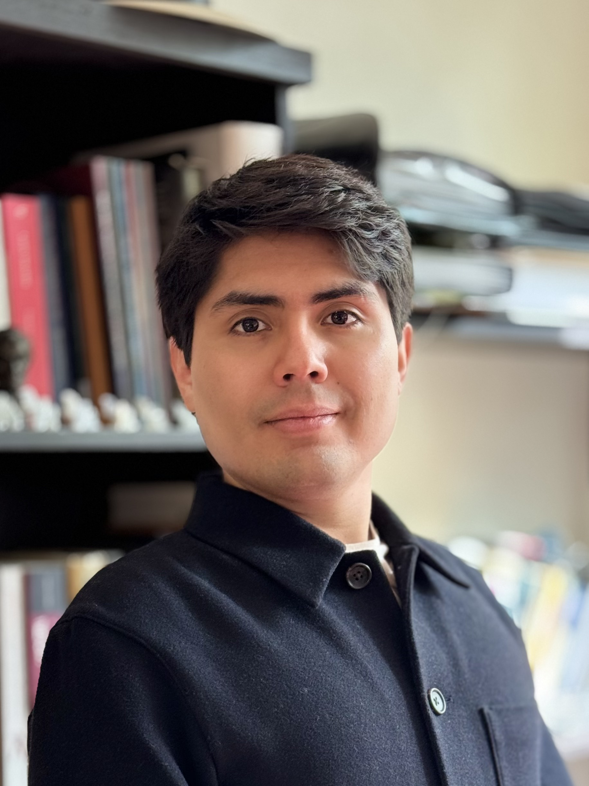

## Instructors

::: {.columns .align-items-start}

::: {.column width="26%"}
{width=170px}
:::

::: {.column width="72%"}

### Petros Pechlivanoglou, PhD

Petros Pechlivanoglou, PhD, is a Scientist at The Hospital for Sick Children (SickKids) Research Institute and an Assistant Professor at the University of Toronto, Institute of Health Policy Management and Evaluation. He studied economics in his native country, Greece, econometrics at the University of Groningen, the Netherlands and obtained a PhD in health econometrics from the same university. He completed a post-doctoral fellowship at the University of Toronto, within the Toronto Health Economics and Technology Assessment (THETA) Collaborative where he focused on methodological aspects around the application of decision analysis in health-care policy.   

:::

:::

---

::: {.columns .align-items-start}

::: {.column width="26%"}
{width=170px fig-align="left"}
:::

::: {.column width="72%"}

### Eline Krijkamp, PhD   

Eline Krijkamp, PhD, is an Assistant Professor at the Erasmus School of Health Policy & Management (ESHPM), Erasmus University Rotterdam. She specializes in health economic modeling and decision science, using R software to support evidence-based healthcare decisions. As part of the DARTH workgroup, her work focused on creating teaching materials and tutorials to improve transparency, reproducibility, and accessibility in health decision sciences. 

In addition to her contributions with the DARTH workgroup, Eline teaches courses such as “Advanced Health Economic Modeling” and “Using R for Decision Modeling in Health Technology Assessment” at Erasmus University and Erasmus Medical Center. She is also part of the External Assessment Group (EAG) in Rotterdam, evaluating medical technologies for the National Institute for Health and Care Excellence (NICE) in the United Kingdom. Eline serves on the board of the Society for Medical Decision Making (SMDM) and is a former SMDM fellow. 
:::

:::

---

::: {.columns .align-items-start}

::: {.column width="26%"} 

{width=170px fig-align="left"}
:::

::: {.column width="72%"}

### Alexandra Moskalewicz, MSc   

Alexandra Moskalewicz is a Research Analyst at the Hospital for Sick Children, supporting research studies on the long-term health and economic impacts of childhood cancer. She holds a Master of Science in Health Services Research from the University of Toronto.    

:::

:::

---

::: {.columns .align-items-start}

::: {.column width="26%"} 
{width=170px fig-align="left"}

:::

::: {.column width="72%"}

### David U. Garibay-Treviño, MSc   

David U. Garibay-Treviño, M.Sc., is currently a Ph.D. candidate at the School of Epidemiology and Public Health at the University of Ottawa. He holds a bachelor’s degree in Economics and a master’s degree in Methods for Public Policy Analysis from Mexico. His research focuses on the development and implementation of decision-analytic models in epidemiology and health policy, with an emphasis on improving their efficiency, transparency, and reproducibility.

In addition to his collaborations with the DARTH group, he is a member of the Society for Medical Decision Making (SMDM) and collaborates with the bladder cancer modeling team within the Cancer Intervention and Surveillance Modeling Network (CISNET), an NIH-sponsored consortium that develops simulation models to evaluate the impact of cancer control interventions. 

:::

:::

## Contact

For questions about preparation, installation, or access to materials, contact:

- `your.email@example.com`
